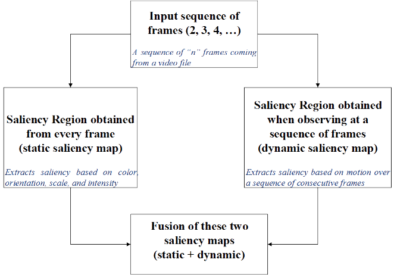
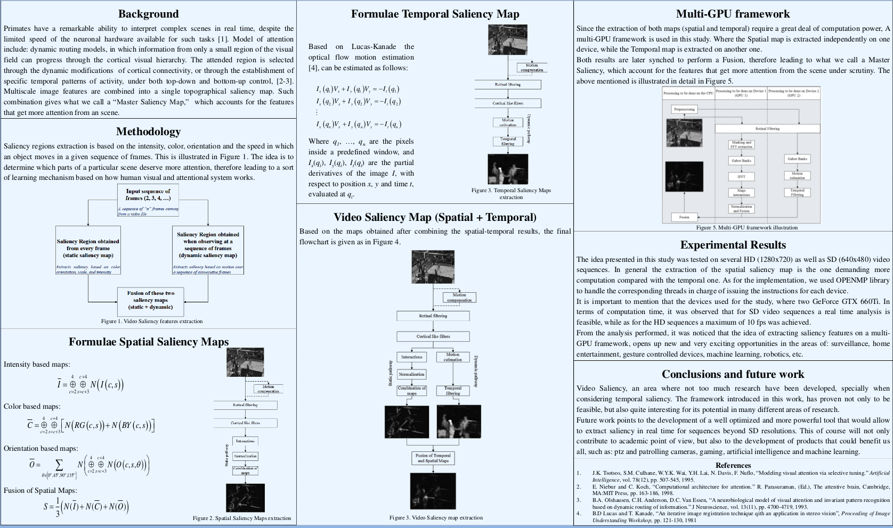
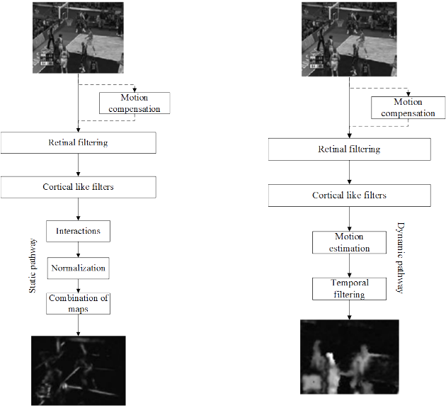
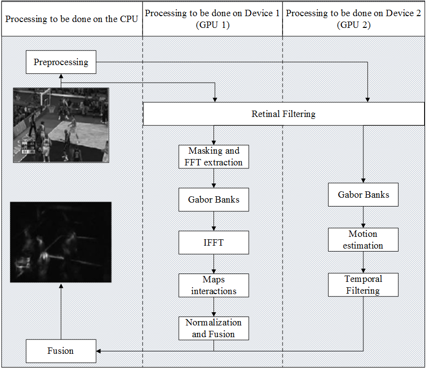

# Spatio-temporal saliency map library with aging pixel and Multi-GPU support

The basic idea is borrowed from the manuscript [Spatio-Temporal Fusion of Visual Attention Models](https://www.eurasip.org/Proceedings/Eusipco/Eusipco2011/papers/1569427221.pdf). Some additional features have been added in this work such as:

1. Full multi-GPU support for Dynamic and Static saliency maps and pre-processing. For the dynamic map all frames are processed at the same time.

2. YUV/RGB frame handling for video sequences, also with GPU support.

3. Flexibility in the number of frames considered for the estimation of the dynamic map.

4. Pixel aging idea in order to help the master map to kind of "Forget" regions of the static map that do not have motion and have not changed for an user-defined number of frames.

### Illustrations

the basic idea of the Spatio-Temporal saliency map is illustrated as follows:

As for the approach to estimate the dynamic and static maps on multiple-gpus the following two images illustrate the idea:

### Main Functions

- YUV2RGB and RGB2YUV conversion. **GPU support**

- Age tracker function and pixel forgetting approach. **GPU support**

- Frame blending to illustrate the Saliency Maps on top of the origial frame. **GPU support**

- Frame enhancer through retinal filtering. **GPU support**

- Gaussian Pyramids for smoothing and subsampling of incoming frames. **GPU support**

- Static, Dynamic, and Master (fusion) maps estimation functions. **multi-GPU support**

### Supported platforms

- So far has only be tested on Windows, but I have no doubts it can be easily ported to Linux. **I haven't had the time to do so**

### Dependencies

Although I tried to code everything myself, some dependencies are required, which are:

- OpenMP

- CImg library: for debuging, check **execute.cu, displayer.cpp and CIMG_disp.h** for details.

- CUDA 6 or later.

### Notes

- This source code is far from complete, any contribution will be appreciated.

- Though the basic idea comes from the paper cited in here, the implementation and other additional tricks were added to simulated a more realistic scenario of how human vision and attentional systems behave.

### How to test

You will have to build your own application to use the API provided in this library. A very simple example is provided inside the **testing_lib** subfolder. **You need FFMPEG to run this**

### Contributors

Josue R. Cuevas
josuercuevas@gmail.com

