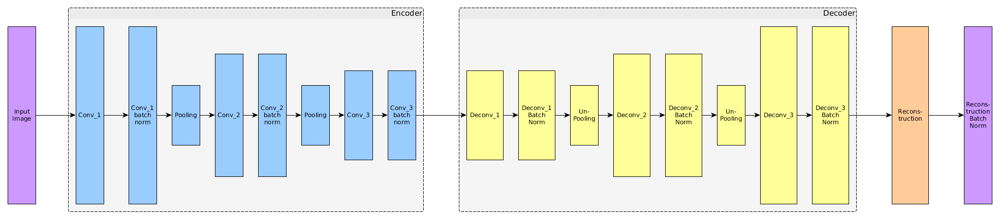

# Simple Autoencoder Implementation tensorflow

**NOTE**: I have experimented a lot with this code, therefore it may not run at first, your **best** reference is the code itself. Any contribution or comment is welcomed.

This is a simple implementation of Autoencoders in Tensorflow, the basic idea is presented in [here](http://ufldl.stanford.edu/tutorial/unsupervised/Autoencoders/) and the visualization of how the models is structured is preseted as follows:

### How to run it

just run "python main.py --help" to get all the information you need to run this code.

### Important notes

1. **Training set**: has to be placed inside the "dataset/Image_files" subfolder, where the idea is to have one class per folder.

2. **Dataset conversion to HDF5**: The model is trained by reading the raw RGB data from an hdf5 format file, which structure is defined in "image_db/create_database.py" it will be good if you take a look of this module.

3. **Model and Logs**: The models checkpoints and tensorboard logs are to be placed inside the "models/" and "tfboard/" subfolder respectively.

4. **Configuration**: The model configuration and settings are defined in "configs/common_configs.py" I have done several tests, therefore some changed may have to be done before you can successfully run this source code.

### Contributor

Josue R. Cuevas

josuercuevas@gmail.com
