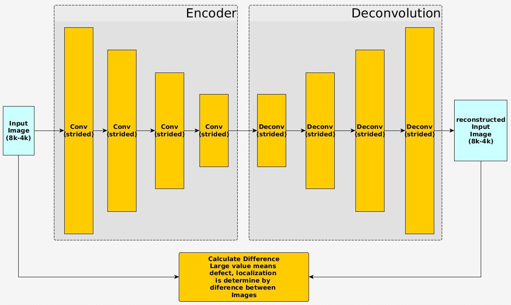

# Denoising AutoEncoders

Denoising Autoencoder implemented for anomaly detection. The basic concept is presented in [here](https://en.wikipedia.org/wiki/Anomaly_detection), so for this project I have implemented autoencoders with the power to denoise input sample images. The anomaly or defect in the image it is assumed to be the noise that supposed to be removed by a well trained autoencoders. The Autoencoder is trained only with good samples and while training a random noise could be added, where a good approximation to the real defect or anomaly will provide better results during inference. The idea is illustrated below:

### How to run it

Just type "python dae.py --help" on linux terminal to see the different options

### Notes

1. **Train and testing**: both functions are provided in this project

2. **Training dataset**: The user has to provide "GOOD" samples in order to teach the model how to reconstruct these samples from noisy ones generated during training. The samples have to be placed inside "training_dataset/" subfolder.

3. **Testing trained model**: Once a model has been trained and is ready for deployment the user may test it with an input image. Please take a look of the code for the image sizes handled by the program (2k, 4k, 8k)

4. **Output results**: They will be placed automatically inside the "results/" subfolder. If you want to modify it you are free to do so in the source code.

5. **Models checkpoints and Logs**: The models checkpoints will be placed inside "models/" and the tensorboard logs in "logs/" subfolders. As for a model ready for deployment you may place it inside "models/latest/".

### Important

Your best reference is the source code, feel free to modify it as you wish. Any contribution is greatly appreciated.

### Contributor

Josue R. Cuevas

josuercuevas@gmail.com
