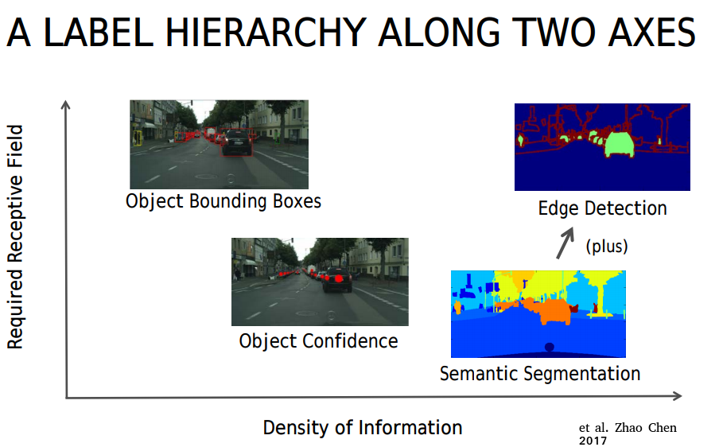
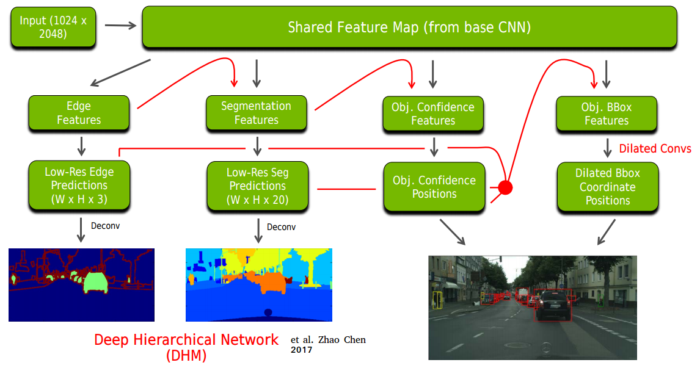

# Deep Hierarchial Model for Joint Object Detection

This is an attempt to replicate the results of a very interesting idea proposed by [Zhao Chen](http://on-demand.gputechconf.com/gtc/2017/presentation/s7347-joe-chen-a-deep-hierarchial-model-for-joint-object-detection.pdf), the main concept is to combine different tasks into a single topology, those tasks are edge or contour extraction, object segmentation and object detection. All these tasks can collaborate with each other in order to have a higher accuracy when detecting and segmenting objects in a scene. The basic concept is presented in the following figures:

The reasoning behind is simple, the features extracted by some of the tasks where smaller receptive fields are required can be used to enhance those tasks where the receptive fields required is large. Therefore the model key idea is summarized as follows:

1. Use a basic classification model to extract features that could be shared across different tasks.

2. The edge detection task should enhance the prediction of the segmented object in the scene

3. The segmentation task should enhance the prediction of the Bounding boxes extracted by the model.

4. Bounding boxes extracted should in theory be much better than performing the tasks alone, since segmentation and edge detection have shared their information.

5. For backpropagation the errors from Bounding boxes -> segmentation -> edge-detection shall provide a better learning strategy for the model.

### Implementation status

I have been working on this for a couple of months now, the code is far from finished, let alone optimized, any collaboration or comment would be appreciated. I have been using Tensorflow, and coco API for data handling and model training.

The creator of the model tested it on [cityscapes](https://www.cityscapes-dataset.com/) dataset, my purpose is not only to replicate the results, but also to use COCO dataset with this model. So far I have implemented three different models for feature extraction shared across tasks or body network: Resnet, SqueezeNet, Helnet. As for the Bounding box detector a gridbox adapted from [detectnet_coverage_rectangular.cpp](https://github.com/NVIDIA/caffe/tree/caffe-0.16/src/caffe/util) was implemented here, very similar to what [DetectNet](https://devblogs.nvidia.com/parallelforall/detectnet-deep-neural-network-object-detection-digits/) has.

### How to train the models

Just type "python main.py --help" to see the different options, it is very important to notice that this code is under heavy development. Therefore you may need to review the code to understand how to run it successfully.

### Notes

1. **Datasets**: training/testing/validation datasets have to be places inside "datasets/" subfolder and the "config.py" file modified accordingly

2. **Models and Logs**: model checkpoints and tensorboard logs have to be places inside "models/" and "tfboard" respectively.

3. **Debuging**: two folders are provided for you to analyze your dataset and information extracted such as masks and Bboxes, the folder are "debug_images" and "debug_masks".

4. **Training status**: So far I have been able to train the model on both COCO and CityScapes however my results are far from those shown in [here](http://on-demand.gputechconf.com/gtc/2017/presentation/s7347-joe-chen-a-deep-hierarchial-model-for-joint-object-detection.pdf), consequently I am spending some time now to debug the code and to see whether I can improve its performance.

### Contributor

Josue R. Cuevas

josuercuevas@gmail.com
