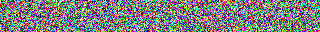

# Denoising Difussion Probability Models

Pytorch implementation of the paper [Denoising Diffusion Probabilistic Model (DDPM)](https://arxiv.org/pdf/2006.11239.pdf) with **multi-gpu support**. DDPM is a parameterized Markov chain trained using variational inference to produce samples matching the data after finite time. Transitions of this chain are learned to reverse a diffusion process, which is a Markov chain that gradually adds noise to the data in the opposite direction of sampling until signal is destroyed (figure below). When the diffusion consists of small amounts of Gaussian noise, it is sufficient to set the sampling chain transitions to conditional Gaussians too, allowing for a particularly simple neural network parameterization.

</img>

# TODOs

- Support Muti-GPU training/inference. <span style="color:green">**DONE**</span>

- Support dataset customization (_just follow the same folder structure format as CIFAR10_). <span style="color:green">**DONE**</span>

- Support Cosine and Linear noises. <span style="color:green">**DONE**</span>

- Support visualization of topologies (unittests). <span style="color:green">**DONE**</span>

- Support Testing module. <span style="color:green">**DONE**</span>

- Support Sampling and Denoising senquence generation. <span style="color:green">**DONE**</span>


# Some Sample Results

Some samples generated from CIFAR10 trained model (for 510k-iterations) are shown in the figure below. The clases for each column are [`airplane`, `car`, `bird`, `cat`, `deer`, `dog`, `frog`, `horse`, `ship`, `truck`].

</img>

A sample of the denoising sequence can also be found below:

</img>


# Model Training

Just run the main script in "**train**" mode as shown below:

```sh
python3 main.py --debug_level 2 --path2interfiles resources --operation train
```

For details on script parameters check the available options with `python train.py --help`. For training parameters please refer the dictionary `PARAM_SETTING` in file `utils/configs.py`.

# Model Inference/Test

Uses test dataset to compute loss. Just run the main script in "**test**" mode as shown below:

```sh
python3 main.py --debug_level 2 --path2interfiles resources --operation test
```

# Model Sample Generation

From random noise it will generate a list of sample images from a given class-list used to training the model. Just run the main script in "**sample**" mode as shown below:

```sh
python3 main.py --debug_level 2 --path2interfiles resources --operation sample
```

# Model Sequence Generation

Will help to visualize how the model generates a sample per class(es) at every iteration. Just run the main script in "**genseq**" mode as shown below:

```sh
python3 main.py --debug_level 2 --path2interfiles resources --operation genseq
```

# Preparing dataset for training/testing:

Please take a look of the README files in the '**resources/datasets**' folder for instructions on preparing the different datasets.

# References

1. [Improved Denoising Diffusion Probabilistic Models](https://arxiv.org/pdf/2102.09672.pdf)

2. [Attention Is All You Need](https://arxiv.org/pdf/1706.03762.pdf)

3. [PixelSNAIL](https://arxiv.org/pdf/1712.09763.pdf)

4. **Useful code**: [Unet](https://github.com/hojonathanho/diffusion/blob/master/diffusion_tf/models/unet.py), [Pixel-cnn](https://github.com/openai/pixel-cnn)


# Visualizing the model components

### Unet (for error/noise reconstruction)

</img>

### Diffusion Model (for sample generation)

</img>