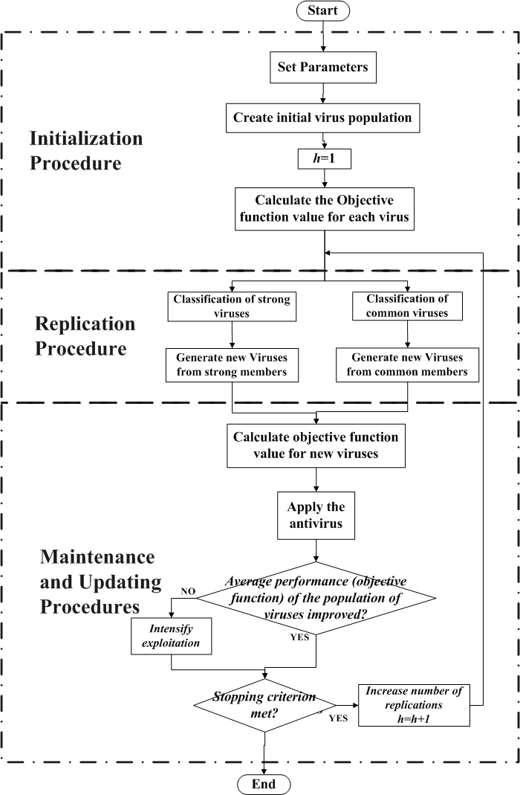
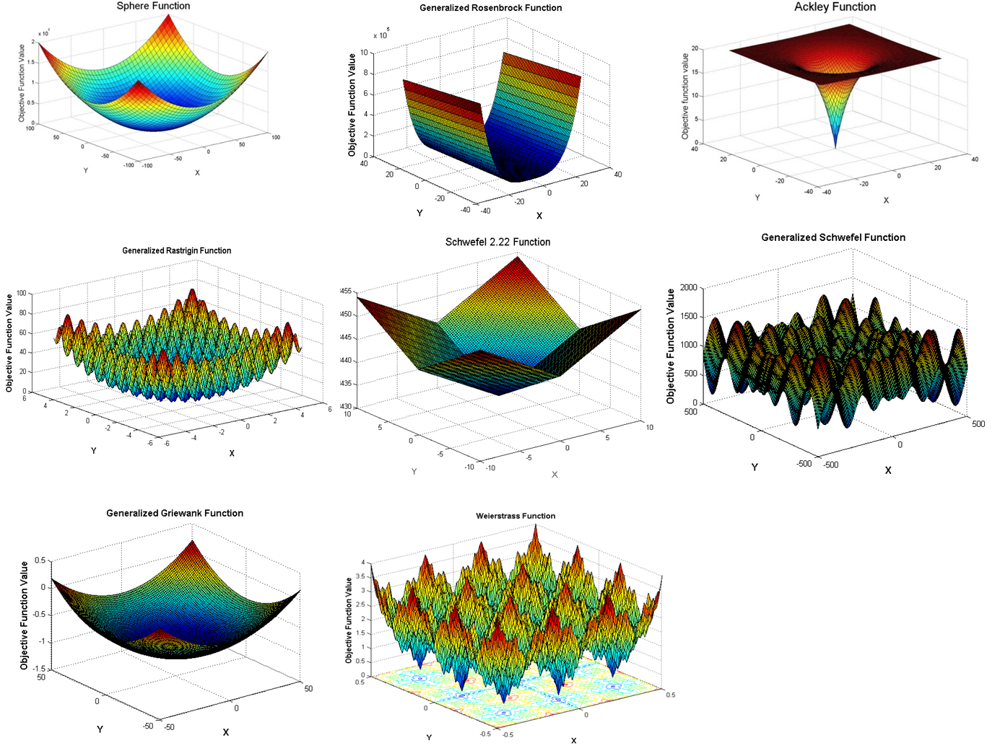

# Virus Optimization Algorithm Test program

Test program to understand VOA, with up to 8 benchmark objective functions supporting shifting and any dimensionality. Programmed in C/C++ environment and MSVC 2012. Publication based on the VOA are detailed as follow:

1. [paper 1](http://www.tandfonline.com/doi/abs/10.1080/0305215X.2014.994868?journalCode=geno20)

2. [paper 2](https://pdfs.semanticscholar.org/9941/736bb5d560ce4f337b1364486f30e4a0439f.pdf)

3. [paper 3](https://pdfs.semanticscholar.org/3fc2/81577a3b68618497f73b1ec88769f99d1232.pdf)

4. [paper 4](https://www.sciencedirect.com/science/article/pii/S0360835216304983)

5. [conference paper very early version](https://www.researchgate.net/publication/266283526_Virus_Optimization_Algorithm_VOA_A_Novel_Metaheuristic_for_Solving_Continuous_Optimization_Problems)

This program is **NOT** designed for research purposes, as it is not optimized and no file dumping is supported for the moment. It is purely **ACADEMIC**. It is distributed under GPL 3.0 license, therefore its usage is free of any charge or responsibility with the author.

For an illustration of the algorithm and the benchmark function supported please take a look of the PNG files in this project.

# Pseudo-code
1. Generate initial viruses
 2. Classify initial population (strong and common)
 3. Optimization process:
	- Generate new viruses
	- Generate pooled population of current and new members
	- Estimate the pooled population members fitness
	- Determine Average objective function value of the whole population
	- Perform population maintenance (Antivirus-Mechanism)
	- Update Intensity and optimization tracker variables
4. Go back to step 3 until stopping criterion met

# Features
1. Supports Shifting in the Benchmark functions
2. 8 benchmark functions can be selected when running the program
3. Any dimensionality (according to computers resources) is supported
4. Stopping criterion for now is just number of iterations.
5. Anti-virus mechanism is implemented every iteration.
6. Intensity value is increased when no improvement is achieved after one iteration.
7. Interactive User parameter setting when running the executable on your **"CMD"** window

# Compilation
The program was written on C/C++ platform, when compiling it please do so in Release and Multibyte format, this will avoid messing up the parsing argument function.

# Algorithm and problem parameters
In this application some algorithmic as well as problem parameters can be user defined, which are:
1. Number of iterations
2. Initial population of viruses
3. Number of viruses to be considered as strong ones in the population
4. Growing rate of strong and common viruses
5. Shifting values for the benchmark functions
6. Benchmark function to be used
7. Debug level to be used
8. Dimensionality of the problem

# TODO
1. Removal of useless code. **in progress**
2. Optimization of all routines. **in progress**
3. Exhaustive debugging to determine possible bugs not yet detected. **in progress**

# Usage Example
1. To print out the help menu just run: **VOA_program.exe -h**
2. To run a simple example solving a sphere function with 2 dimensions and up to 10 iterations, printing out all the information up to DEBUG-level output, just type: **VOA_program.exe -stop_iterations 10 -debug_level debug -dimensions 2 -function sphere**

# Modification and Merge Requests
In case of a contribution by a particular developer or user, please contact the author and state your changes and as to what kind of modification you wish to place your code, which could be one of the following:
1. Hot Fix (Documentation)
2. Patch (extra/reduction source code for a better user experience)
4. Program Bug issue (crash fixate)
5. Algorithmic Performance issue (algorithm enhancement)
6. Program Performance issue (source code ehancement)
7. License issue

# Contributor

Josue Rodolfo Cuevas

josuercuevas@gmail.com
