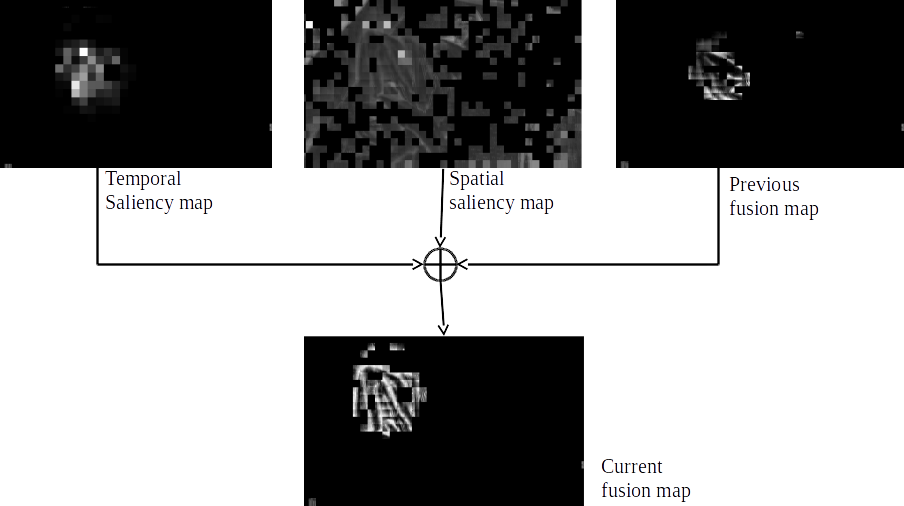
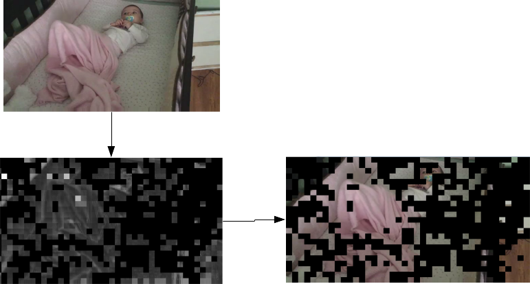

# Bitstream analyzer based on openh264 Library

This is a saliency mapping and h264-bitstream analyzer based on [OpenH264](https://github.com/cisco/openh264), please refer to file **README_original** for details on how to build this library. The major contributions can be seen in the following files:

1. **codec/decoder/core/src/SaliencyEstimatorFunctions.cpp**
2. **codec/api/svc/codec_def.h**
3. **codec/decoder/core/src/decoder_core.cpp**
4. **codec/decoder/core/src/decode_slice.cpp**
5. **codec/decoder/core/inc/decoder_context.h**
6. **codec/decoder/core/inc/SaliencyEstimator.h**
7. **codec/decoder/plus/src/welsDecoderExt.cpp**

The main idea of this project is basically to determine saliency from the bitstream itself avoiding to have to decode the whole frame and then perform saliency detection afterwards. This could be useful to partially decode the frame at regions where saliency is large and ignore those where it is not.

The saliency map extraction is presented in the following picture:

As for the Partial decoding idea, it is detailed as follows:

### CONTRIBUTORS

Josue R. Cuevas

josuercuevas@gmail.com
